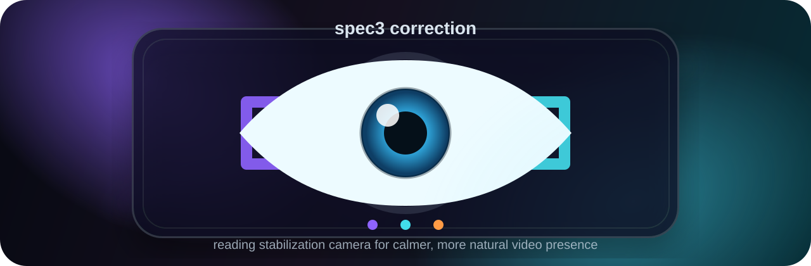

<p align="center">
  
</p>

<h1 align="center">spec3 correction</h1>

<p align="center">
  <strong>A macOS camera app that keeps your eyes calmer and more natural while reading on screen.</strong>
</p>

<p align="center">
  
  
  
  
  
</p>

## Overview

`spec3 correction` is a local macOS camera tool for reading-heavy calls, interviews, streams, and meetings. It detects your face, tracks the eyes, reduces obvious reading motion, and keeps the result from looking frozen or robotic.

The goal is simple: when you read from the screen, your eyes should look steadier. When you are not reading, the look should still feel alive.

## Highlights

- **Reading stabilization**: reduces visible pupil movement when you read from text on screen.
- **Natural eye life**: adds controlled micro-motion so the eyes do not look locked.
- **Personal AI**: lets you train READ, LIVE, and LOOK examples for your own face, camera, lighting, and screen position.
- **Camera picker**: chooses the real input camera while filtering stale virtual-camera slots.
- **OBS Bridge**: sends the corrected spec3 feed to `OBS Virtual Camera` for Zoom, Meet, Yandex, Telegram, Discord, and similar apps.
- **Single-window workflow**: camera preview, controls, logs, settings, and training live in one native-feeling macOS app.
- **Local first**: processing runs on your Mac; the app does not need a cloud service to work.

## How It Works

```text
physical camera
      |
      v
MediaPipe face and eye landmarks
      |
      v
spec3 reading detector + Personal AI
      |
      v
gaze stabilization and natural motion renderer
      |
      +--> app preview
      |
      +--> OBS Bridge / virtual-camera pipeline
```

## Quick Start

1. Open `spec3 correction.app`.
2. Allow camera access when macOS asks.
3. Choose your real camera from the in-app camera menu.
4. Turn the app `ON`.
5. Tune `Stabilizer Power`, `Eye Direction`, `Reading Hold`, `Smoothness`, and `Eye Life`.
6. Open `Training` if you want the READ detector to adapt to your own behavior.

## Use In Video Calls

The practical video-call route is OBS:

1. Install OBS Studio.
2. In `spec3 correction`, open `Settings`.
3. Press `Start OBS Camera`.
4. Approve `OBS Virtual Camera` once in macOS if requested.
5. In Zoom, Meet, Yandex, Telegram, Discord, or another app, choose `OBS Virtual Camera`.

Why OBS? macOS virtual cameras are system camera extensions. A fully branded `spec3 correction Camera` requires Apple Developer system-extension signing. OBS already ships a trusted virtual camera, so `spec3 correction` can use it as a reliable bridge.

More detail: [OBS Bridge](docs/obs_bridge.md).

## Main Controls

| Control | Purpose |
| --- | --- |
| `ON / OFF` | Enables or disables gaze correction. |
| `Camera` | Selects the physical camera source. |
| `Reading detector` | Shows `READ` when reading stabilization is active and `LIVE` otherwise. |
| `Stabilizer Power` | Controls correction strength. |
| `Eye Direction` | Moves the reading target up or down for your monitor setup. |
| `Reading Hold` | Controls how firmly the eyes stay stable during reading. |
| `Smoothness` | Softens transitions and reduces sudden jumps. |
| `Eye Life` | Adds subtle natural movement. |
| `Personal AI` | Opens the training window. |
| `Logs` | Opens readable runtime diagnostics. |
| `Settings` | Opens theme, style, language, and OBS controls. |
| `Hide` | Hides the window while the app keeps running in the background. |
| `Quit` | Fully exits the app. |

## Personal AI Training

The training panel records short examples for three states:

| State | Record This |
| --- | --- |
| `READ` | Read text naturally from your usual screen position. |
| `LIVE` | Look normally at the camera or a central point. |
| `LOOK` | Make normal side glances and casual eye movement. |

After training, the model is saved locally and reused on later launches. You can add fresh samples whenever lighting, camera position, or your screen setup changes.

## Requirements

- macOS 14 Sonoma or later.
- Built-in MacBook camera or external webcam.
- Camera permission granted to `spec3 correction`.
- OBS Studio for video-call output through `OBS Virtual Camera`.

## Development

Run the app locally:

```bash
python3 bin_single_window.py --backend mediapipe
```

Build the desktop app:

```bash
./script/build_and_run.sh --verify
```

Start the OBS bridge manually:

```bash
./script/start_obs_bridge.sh
```

## Troubleshooting

- **Preview is black**: choose the correct physical camera and close any app that may be holding it.
- **Camera list looks stale**: quit the app fully, reconnect cameras, then reopen.
- **OBS Virtual Camera does not appear**: approve OBS in `System Settings -> General -> Login Items & Extensions -> Camera Extensions`, then reopen the meeting app.
- **READ mode feels wrong**: record new Personal AI examples in the same lighting and screen position you normally use.
- **Eyes look too frozen**: lower `Reading Hold` or increase `Eye Life`.
- **Eyes move too much while reading**: increase `Stabilizer Power` and `Reading Hold`.

## Project Status

`spec3 correction` is actively being shaped around one job: calmer, more natural on-camera reading. The current focus is reliability, camera selection, READ detection, realistic eye rendering, and a clean path into video-conference apps.
